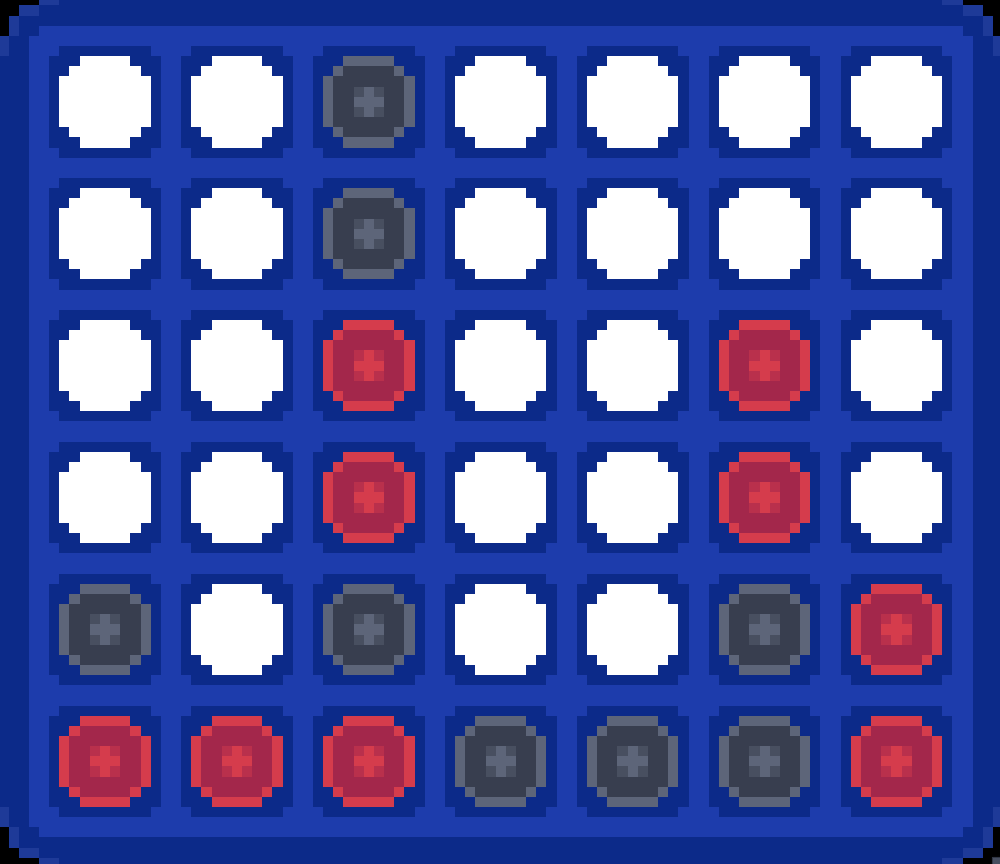

<a name="readme-top"></a>


<br />
<div align="center">
  
  <h3 align="center">Connect4 RL Agent</h3>
  <p align="center">
  Python implementation of a connect-four game agent using the PettingZoo library.
  <br />
     
    
[![Contributors][contributors-shield]][contributors-url]
[![Forks][forks-shield]][forks-url]
[![Stargazers][stars-shield]][stars-url]
[![MIT License][license-shield]][license-url]
    
  </p>
</div>

<details>
  <summary>Table of Contents</summary>
  <ol>
    <li>
      <a href="#about-the-project">About The Project</a>
    </li>
    <li>
      <a href="#environment">Environment</a>
    </li>
    <li>
      <a href="#code-structure">Code Structure</a>
    </li>
    <li>
      <a href="#getting-started">Getting Started</a>
    </li>
    <li><a href="#usage">Usage</a></li>
    <li><a href="#results">Results</a></li>
    <li><a href="#contributors">Contributors</a></li>
    <li><a href="#license">License</a></li>
  </ol>
</details>


## About The Project
This project implements an agent for Connect4 using Reinforcement Learning methods. The implementation is based on the PettingZoo library, which provides a standardized interface for multi-agent environments.  
We implemented the Advantage Actor-Critic (A2C) algorithm.

<p align="right">(<a href="#readme-top">back to top</a>)</p>

## Environment
The Connect4 environment is provided by PettingZoo and can be found at: https://pettingzoo.farama.org/environments/classic/connect_four/

<p align="right">(<a href="#readme-top">back to top</a>)</p>

## Code Structure
Our code consists of the following files:
- projet/agent/: contains the agent classes (base_agent.py, actor_critic.py, random.py, and human.py)
- projet/game.py: contains the Game class which handles training and evaluation
- main.py: main script to run the game

<p align="right">(<a href="#readme-top">back to top</a>)</p>

## Getting Started
This is an example of how you may give instructions on setting up your project locally.
To get a local copy up and running follow these simple example steps.

1. Clone the repo
   ```sh
   git clone https://github.com/flaviendeseure/connect4_rl_agent.git
   cd connect4_rl_agent
   ```
2. Install Python packages  
   a. With Poetry
   ```sh
    poetry install
    ```
   b. With a virtual environment
   ```sh
    python -m venv connect4_rl_agent
    source connect4_rl_agent/bin/activate
    pip install --upgrade pip
    pip install -r requirements.txt
    ```

<p align="right">(<a href="#readme-top">back to top</a>)</p>


## Usage
Once you have installed the dependencies, you can use the project by running the main.py file with the appropriate command line arguments.  

- **Here is an example command to train the agent(s):**
  - With poetry
  ```sh
  poetry run main --train --epoch 10000 --player_0 actor_critic --player_1 actor_critic
  ``` 
  - With a virtual environment
  ```sh
  python -m projet --train --epoch 10000 --player_0 actor_critic --player_1 actor_critic
  ```   
- **Here is an example command to evaluate an agent(s)**:
  - With poetry
  ```sh
  poetry run main --eval --player_0 actor_critic --player_1 random --epoch 1000
  ``` 
  - With a virtual environment
  ```sh
  python -m projet --eval --player_0 actor_critic --player_1 random --epoch 1000
  ```   
- **Here is an example command to play the game against the agent(s)**:
  - With poetry
  ```sh
  poetry run main --play --player_0 human --player_1 actor_critic
  ``` 
  - With a virtual environment
  ```sh
  python -m projet --play --player_0 human --player_1 actor_critic
  ```   

**The available command line arguments are**:  
- ***--train:*** Train the agent(s) using reinforcement learning. **Default: False**.
- ***--eval:*** Evaluate the agent(s) by playing against themself. **Default: False**.
- ***--play:*** Play the game against the agent(s) or a human. **Default: False**.
- ***--epoch:*** Number of epochs to train or evaluate the agent(s) for. **Default: 100000**.
- ***--verbose:*** Level of verbosity during training or evaluation. **Default: 1**.
- ***--save:*** Save the trained agent(s) after training. **Default: True**.
- ***--load:*** Load a pre-trained agent(s). **Default: True**.
- ***--player_0:*** Type of player for player 0. Available options are *actor_critic*, *actor_critic_conv*, *random*, and *human*. **Default: actor_critic**.
- ***--player_1:*** Type of player for player 1. Available options are *actor_critic*, *actor_critic_conv*, *random*, and *human*. **Default: actor_critic**.


<p align="right">(<a href="#readme-top">back to top</a>)</p>

## Results
We trained the agent using an Advantage Actor-Critic (A2C) algorithm and evaluated its performance against a random agent. The results are presented in the table below:
|          |          | Number of victory | Number of draw | % of victory* | % of victory (without draw)* |
|----------|----------|-------------------|----------------|---------------|------------------------------|
| Player 1 | A2C      |        499        |        0       |     64.9%     |             64.9%            |
|          | A2C Conv |        550        |        0       |     82.3%     |             82.3%            |
| Player 2 | A2C      |        481        |       242      |     48.1%     |             63.5%            |
|          | A2C Conv |        510        |       296      |     51.0%     |             72.4%            |
| Mean     | A2C      |        490        |       121      |     56.5%     |             64.2%            |
|          | A2C Conv |        530        |       148      |     66.7%     |            77.35%            |

<p align="right">(<a href="#readme-top">back to top</a>)</p>

## Contributors
This project was developed by [Yoan Gabison](https://github.com/YoanGab), [Noam Benitah](https://github.com/NoamBenitah) and [Flavien Deseure--Charron](https://github.com/flaviendeseure) as part of a class project.

<p align="right">(<a href="#readme-top">back to top</a>)</p>

## License
Distributed under the MIT License. See `LICENSE.txt` for more information.

<p align="right">(<a href="#readme-top">back to top</a>)</p>

[contributors-shield]: https://img.shields.io/github/contributors/flaviendeseure/connect4_rl_agent.svg?style=for-the-badge
[contributors-url]: https://github.com/flaviendeseure/connect4_rl_agent/graphs/contributors
[forks-shield]: https://img.shields.io/github/forks/flaviendeseure/connect4_rl_agent.svg?style=for-the-badge
[forks-url]: https://github.com/flaviendeseure/connect4_rl_agent/network/members
[stars-shield]: https://img.shields.io/github/stars/flaviendeseure/connect4_rl_agent.svg?style=for-the-badge
[stars-url]: https://github.com/flaviendeseure/connect4_rl_agent/stargazers
[license-shield]: https://img.shields.io/github/license/flaviendeseure/connect4_rl_agent.svg?style=for-the-badge
[license-url]: https://github.com/flaviendeseure/connect4_rl_agent/blob/master/LICENSE.txt
